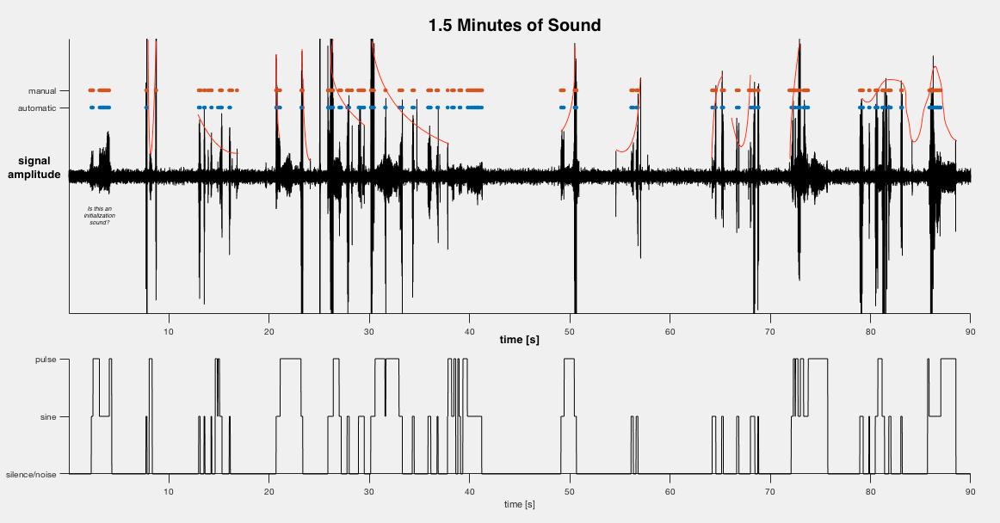

## Introduction

Adjustment of speech or song intensity is an important aspect for effective communication between individual organisms. Sound patterns are useless if the sound itself is inaudible to the listener. Dynamic intensity modulation has been observed in insects and songbirds.

AMD requires the ability to modulate signal amplitude as well as accurately measure distance.

1. Flies can produce large amplitude variations over 10s of millisecond timescales
2. Flies can use visual cues to compute $\arg\max(\mathbf{r}_1, \mathbf{r}_2)$
3. Song mode $\propto |\mathbf{r}_\text{transmitter} - \mathbf{r}_{receiver}|$, measured using visual cues (Pip Coen, et. al., 2014)

$\sum\limits^3_{i=1} \text{fact}_i \implies$ flies have the capacity for AMD. 

AMD requires sensorimotor transformation (I asked this question in `README.md`) , computing distance from visual signals and then computing and generating dynamical accoustic signals. 

- **Question**: is the speed of sound on earth embedded in the fly brain? What other physical constants are embedded in biology?

#### Results Preview

- Male flies rely on vision to compensate for observed song intensity
- Specific visual stimulus features required (**this is where it is important to understand nuance**)
- Neural pathways that carry distance information and the point of intersection between visual processing and song motor circuits. 
- A single circuit independently regulates song amplitude and timing and effective communication relies on changing the gain of the accoustic signal. 
  - **You could train a neural spiking model to learn to perform this and see what the connectivity that comes out is. The temporal information needs to be stable relative to distance input ports. First try training a Poisson spiking model using a simplified model of neural frequency to sound intensity and use P1Ang as supervised training data**.

#### Song Modes

- Pulses are fire and go and cannot be interrupted with a "`SIGINT`".
- Sine sounds can be dynamically modulated

**Exploratory Data Analysis**

- All variates Z-scored (keep in mind when I do my own analysis)
- Dis and then mFv most powerful predictors of amplitude. 
  - In particular, Dis and mFv are most predictive at 470ms and 100ms.
  - Wide peak and residual predictive power (saturation) derive from the wide autocorrelation of this feature during natural courtship. 
  - **male female distance is the strongest predictor of pulse amplitude**. This demonstrates that **Drosophila males perform AMD*

I ran the songsegmentation code and here's what I got out of it: 

My Own initial Observations

- The subsecond timescale of amplitude modulation
- Does Delta(sine) interpolate with Delta(pulse)?
- The pulse and sine signals are interspesed and yet there is continuity across pulse signals
- What are the behavioral units here or is it all one behavioral unit
- The scale of AMD is, just visually, highly nonlinear and quite limited in range
- There is a reset point
- Correlation between amplitude of adjacent pulses 
  - Is this also correlated with distance or is it a residual/resetting bug?
- What is the temporal resolution of mode switching and AMD? 
- **Pulses are very sparse, sines less so**
- Sines dont appear to have AMD, only pulses: this is the opposite of what would be expected if sines are dynamical and pulses are discrete. need to explore the neurodynamics of this. 

The nagging question is what kind of latent variables exist that can be used to explain this data? What is the computational/logical structure of:

1. Song mode switching and memory through the interspersement
2. Amplitude Modulation
3. How can song modes be disrupted 

Now if you look at the above plot of distance over time, the flies are operating in the 10-20mm range. A simple calculation reveals that it takes approximately $60 [\mu s]$ for sound from fly A to reach fly B. (**look in context of physics of sound sensing**). Well that means Dis470 in the paper is many orders of magnitude longer than the time it takes for sound to travel between the flies.

## Important Temporal and Spatial Scales

- 470ms and 100ms timescales are strongest delays in predicting amplitude (a neuronal dynamic, also where is this information being stored in the brain?)

When modulating a signal in real time, the sensorimotor process must be fast enough for it to have ethological value. 

Thus, the fly must accurately estimate the position of its partner but also change his pulse amplitude before the information becomes outdate (**TODO:** get some information on fly velocity, can be calculated from `P1Ang` and `P1Dis` datasets).

### What kind of modulation happens?

Do males modulate entire song pulse trains based on a single distance estimate, or do they modulate individual pulses?

The optimal delay at which distance is predictive is independent of pulse position within a train. This means that the fly modulates amplitude on a pulse-by-pulse basis. 

Initial pulses always of lower amplitude, regardless of whether no female is present (males coerced to make pulses optogenetically). Therefore, **exclude initial 2 pulses from all analysis**

- Baseline amplitude for pulses is integrated visually over 100s of milliseconds (hence Dis470 most predictive) 
- Adjusted on a pulse by pulse basis as new more detailed information arrives. Low latency coupling (order of 35ms).

## What Do Drosophila Rely On?

-  Humans use vision, do Drosophila?

### Controls

- Rendering **males deaf or pheromone insensitive** has **little effect**
- **Blind males** exhibited **drastically exaggerated mean pulse amplitude**
  - Is the system continuous and greedy in the sense that it will make the best prediction it possibly can, or is the male being blind a discontinuity and handled as a special case neuronally?

### Results

- Little overlap in distribution of pulse amplitudes in blind and seeing flies
- AMD eliminated in blind flies, and they always sing louder
- Males use vision to detect distance

### Special Cases

- Sub 5mm distance estimation (1 body length)
- Residual AMD abolished when not facing female and blind males sang louer pulses when not facing female
- Because blind and WT have the same results, this shows that <5mm, flies use non-visual sensory cues such as olfactory information
- But olfactory-diminished flies also exhibited reduced amplitude so something else must be going on

## Visual Features Used for Distance Estimation

- Flies estimate distance with only one eye, so they dont combine information from both the visual field. They do AMD equally as well in the regular and overlapped portion of the visual field. 
- Stimuli at 144Hz, that's $7.0 [\text{ms}]$ per frame. 

## Visual Pathways

- Males default to high amplitude pulses when not facing females. It is a step function therefore, with modulated amplitude when facing female and a discontinuous jump to constant high amplitude when not facing female. 
- Visual signals intersect the song pathway. 

